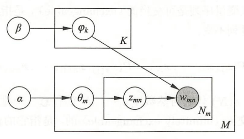

# LDA主题模型

<p align="right">陈煜磊 ZY2103502


## 1 问题概述
​	从给定的语料库中均匀抽取 200 个段落（每个段落大于 500 个词）， 每个段落的标签就是对应段落所属的小说。利用 LDA 模型对于文本建模，并把每个段落表示为主题分布后进行分类。验证与分析分类结果。

## 2 原理

### 2.1 模型定义

​	隐含狄利克雷分布（Latent Dirichlet Allocation, LDA）是 2003 年提出的一种主题模型，它可以将文档集中每篇文档的主题以概率分布的形式给出。它使用三个集合，分别为：

- 单词集合 $W=\{ w_{1},\cdots,w_{V}\}$
- 文本集合 $D=\{ \mathrm w_{1},\cdots,\mathrm w_{M}\}$ ，其中 $\mathrm w_m$ 是第 $m$ 个文本 ， $w_{mn}$ 是第 $m$ 个文本中第 $n$ 个单词。
- 话题集合 $Z=\{ z_{1},\cdots,z_{K}\}$

​	每个话题 $z_k$ 都由一个单词的条件概率分布 $p(w|z_k)$ 决定 ，该分布服从多项分布，其参数 $\varphi_k$ 服从超参数为 $\beta$ 的狄利克雷分布（先验分布）。参数 $\varphi_k$ 为 $V$ 维向量，其中 $\varphi_{kv}$ 表示话题 $z_k$ 生成单词 $w_v$ 的概率；所有话题参数构成 $K\times V$ 矩阵 $\bold{\varphi}=\{\varphi_k\}^K_{k=1}$。参数 $\beta$ 为 $V$ 维向量。

​	每个文本 $\mathrm w_m$ 都由一个话题的条件概率分布 $p(z|\mathrm w_m)$ 决定 ，该分布服从多项分布，其参数 $\theta_m$ 服从超参数为 $\alpha$ 的狄利克雷分布（先验分布）。参数 $\theta_m$ 为 $K$ 维向量，其中 $\theta_{mk}$ 表示文本 $\mathrm w_m$ 生成话题 $z_k$ 的概率；所有文本参数构成 $M\times K$ 矩阵 $\bold{\theta}=\{\theta_m\}^M_{m=1}$。参数 $\alpha$ 为 $K$ 维向量。

​	LDA 本质上是一种概率图模型，如下图：


其中模型超参数为 $\alpha$ 和 $\beta$ ，$\varphi_k$ 为话题的单词分布参数，$\theta_m$ 是文本的话题分布参数，$z_{mn}$ 表话题，$w_{mn}$ 表单词。图中：

- 结点 $\alpha$ 指向 $\theta_m$ ，重复 $M$ 次，表示根据超参数 $\alpha$ 生成 $M$ 个文本的话题分布参数 $\theta_m$ 
- 结点 $\beta$ 指向 $\varphi_k$ ，重复 $K$ 次，表示根据超参数 $\beta$ 生成 $K$ 个话题的单词分布参数 $\varphi_k$ 
- 结点 $\theta_m$ 指向 $z_{mn}$ ，重复 $N_m$ 次，表示根据文本的话题分布 $\theta_m$ 生成 $N_m$ 个文本的话题 $z_{mn}$ 
- 结点 $z_{mn}$ 和 $K$ 个 $\varphi_k$ 指向 $w_{mn}$ ，表示根据话题 $z_{mn}$ 和 $K$ 个话题的单词分布参数 $\varphi_k$ 生成单词 $w_{mn}$ 

### 2.2 基于变分 EM 算法的模型训练

LDA 模型的学习

## 3 代码

​	本文基于 Python 进行 LDA 模型的训练。首先使用``jieba``对各小说进行分词，并用``sklearn``中的``CountVectorizer``进行词频统计，对中文的词频统计在作业 1 中有详细阐述。上述步骤在``novel_gen``函数中实现。

`````python
def novel_gen(sourcepath, stpwrdpath,):
    files = os.listdir(sourcepath)
    with open(stpwrdpath, 'rb') as fp:
        stopword = fp.read().decode('utf-8') 
    stpwrdlst = stopword.splitlines()
    seg_list = []
    for file in files:
        fullpath = sourcepath + '\\' + file
        with open(fullpath, "r", encoding="ANSI") as f:
            data = f.read().replace('\u3000','').replace('\n','').replace(' ','')
        seg = " ".join(jieba.lcut(data, use_paddle=True, cut_all=False))
        seg_list.append(seg)
    vec = CountVectorizer(token_pattern = r"(?u)\b\w\w+\b", 
                          max_features = 5000,
                          stop_words = stpwrdlst, 
                          max_df = 0.5)
    cnt = vec.fit_transform(seg_list)
    # print( 'vocabulary dic :\n\n',vec.vocabulary_)
    return cnt,vec
`````

​	将``CountVectorizer``所得各小说词频加入``sklearn``中的LDA模型，使用变分 EM 算法训练模型超参数，得语料库对应的 LDA 模型。

​	接下来使用该模型对210条段落进行分类。首先对文本预处理，从给定的语料库中均匀抽取 210 个段落。以换行符作为分段依据，取语料库中足够长的小说共 14 部，以换行符``\n``分段，均匀取每部小说中 15 个超过 2000 字的段落中的前2000字，不足字数的段落合并处理。这样得到 210 个文档。

`````python
def get_para(path,min_char):
    with open(path, "r", encoding="ANSI") as f:
        content = f.read()
        l = len(content)
        paras = []
        tmp_char = ''
        for i, char in enumerate(content):
            if char != '\u3000':
                tmp_char += char
            if char == '\n':
                tmp_char = tmp_char[:-1]
                if len(tmp_char) >= min_char:
                    paras.append(tmp_char[0:min_char])
                    tmp_char = ''
                else:
                    continue
            if (i + 1) == l:
                if len(tmp_char) >= min_char:
                    paras.append(tmp_char[0:min_char])
                break
    f.close()
    paras = paras[::int(len(paras)/15)][0:15]
    return paras
`````

​	同样使用``jieba``对各文档进行分词，``CountVectorizer``进行词频统计，注意统计时需使用训练模型时的词汇表。将文档-词频输入模型中，得文档-主题的概率向量。计算各个文档概率向量与各个小说的概率向量的相似程度（这里使用欧氏距离），即可判断各个文档属于哪篇小说，完成分类。

`````python
def print_res2(res1, res2):
    match = 0
    for j, p2 in enumerate(res2):
        dis = [] 
        for i, p1 in enumerate(res1):
            dis.append(np.sqrt(np.sum((p1-p2)**2)))  
        match_idx = dis.index(min(dis))
        print(j,'→',match_idx)
        if (int(j/15) == match_idx):
            match += 1
    print('正确率: %f %%' %(match/len(res2)*100))  
`````

## 4 数据及总结

​	使用小说训练模型，得每个主题对应的 10 个最大概率单词结果如下：

`````mathematica
Topic #0:
张无忌 张翠山 谢逊 周芷若 教主 赵敏 明教 殷素素 张三丰 灭绝师太
Topic #1:
堂子 水师营 门庭 妓知 宫城 破鞋 非君 大发横财 回奏 请吃
Topic #2:
堂子 水师营 门庭 妓知 宫城 破鞋 非君 大发横财 回奏 请吃
Topic #3:
韦小宝 石破天 康熙 太后 吴三桂 教主 双儿 罗刹 天地会 海老公
Topic #4:
堂子 水师营 门庭 妓知 宫城 破鞋 非君 大发横财 回奏 请吃
Topic #5:
陈家洛 张召重 徐天宏 霍青桐 余鱼同 文泰来 乾隆 李沅芷 陆菲青 周仲英
Topic #6:
袁承志 青青 袁崇焕 何铁手 崇祯 金蛇 洪胜海 焦宛儿 皇太极 崔秋山
Topic #7:
堂子 水师营 门庭 妓知 宫城 破鞋 非君 大发横财 回奏 请吃
Topic #8:
郭靖 黄蓉 洪七公 欧阳锋 黄药师 周伯通 丘处机 郭靖道 黄蓉道 欧阳克
Topic #9:
杨过 小龙女 李莫愁 郭靖 黄蓉 法王 陆无双 周伯通 赵志敬 郭襄
Topic #10:
羊角 街坊 外宅 拿获 易姓 指其 不居 贤者 设筵 技能
Topic #11:
胡斐 程灵素 苗人凤 袁紫衣 马春花 胡斐道 福康安 赵半山 胡一刀 田归农
Topic #12:
令狐冲 段誉 虚竹 萧峰 岳不群 林平之 岳灵珊 王语嫣 乔峰 慕容复
Topic #13:
狄云 水笙 万震山 丁典 戚芳 万圭 血刀 花铁干 血刀老祖 吴坎
`````

可从上述结果中看到一些比较明显的主题与小说向对应，例如 Topic #0 对应《倚天屠龙记》， Topic #3 对应《鹿鼎记》， Topic #8 对应《射雕》，Topic #9 对应《神雕侠侣》，但还有近一半的分类效果与小说无法对应。

​	我们将每篇小说对应概率最大的 Topic 打出，印证了猜测。

`````python
Topic #0:
[3]
Topic #1:
[]
Topic #2:
[]
Topic #3:
[2, 13]
Topic #4:
[]
Topic #5:
[1]
Topic #6:
[0, 7]
Topic #7:
[]
Topic #8:
[5]
Topic #9:
[8]
Topic #10:
[]
Topic #11:
[11, 12]
Topic #12:
[4, 6, 9]
Topic #13:
[10]
`````

​	使用训练完成的模型对 210 个文档的分类。文档-主题的概率也可以验证主题与小说向对应的猜测，例如《倚天屠龙记》中抽取的 15 个文档对应的概率向量为：

`````mathematica
array([[8.53071813e-01, 2.76854928e-04, 2.76854928e-04, 2.76855594e-04,
        2.76854928e-04, 2.76855596e-04, 2.76856718e-04, 2.76854928e-04,
        2.76856951e-04, 1.43605922e-01, 2.76854928e-04, 2.76855388e-04,
        2.76855836e-04, 2.76855156e-04],
       [9.95086920e-01, 3.77928949e-04, 3.77928949e-04, 3.77929331e-04,
        3.77928949e-04, 3.77929252e-04, 3.77929188e-04, 3.77928949e-04,
        3.77929466e-04, 3.77929470e-04, 3.77929083e-04, 3.77929539e-04,
        3.77929416e-04, 3.77929151e-04],
       [9.95112777e-01, 3.75939850e-04, 3.75939850e-04, 3.75940213e-04,
        3.75939850e-04, 3.75940222e-04, 3.75940130e-04, 3.75939850e-04,
        3.75940807e-04, 3.75940834e-04, 3.75939850e-04, 3.75940355e-04,
        3.75940697e-04, 3.75940576e-04],
       [9.94925835e-01, 3.90320062e-04, 3.90320062e-04, 3.90320555e-04,
        3.90320062e-04, 3.90320549e-04, 3.90320827e-04, 3.90320062e-04,
        3.90320571e-04, 3.90320393e-04, 3.90320062e-04, 3.90320866e-04,
        3.90320658e-04, 3.90320422e-04],
       [9.94869765e-01, 3.94632991e-04, 3.94632991e-04, 3.94633803e-04,
        3.94632991e-04, 3.94633462e-04, 3.94633522e-04, 3.94632991e-04,
        3.94633766e-04, 3.94633711e-04, 3.94632991e-04, 3.94633786e-04,
        3.94634322e-04, 3.94633208e-04],
       [9.94406189e-01, 4.30292599e-04, 4.30292599e-04, 4.30293171e-04,
        4.30292599e-04, 4.30293650e-04, 4.30293244e-04, 4.30292599e-04,
        4.30293466e-04, 4.30294869e-04, 4.30292599e-04, 4.30293293e-04,
        4.30293568e-04, 4.30292750e-04],
       [9.93460755e-01, 5.03018109e-04, 5.03018109e-04, 5.03019161e-04,
        5.03018109e-04, 5.03018507e-04, 5.03018925e-04, 5.03018109e-04,
        5.03019047e-04, 5.03019742e-04, 5.03018109e-04, 5.03018966e-04,
        5.03019861e-04, 5.03019871e-04],
       [9.94724020e-01, 4.05844156e-04, 4.05844156e-04, 4.05845059e-04,
        4.05844156e-04, 4.05844419e-04, 4.05844571e-04, 4.05844156e-04,
        4.05844870e-04, 4.05845009e-04, 4.05844156e-04, 4.05844772e-04,
        4.05845318e-04, 4.05844827e-04],
       [9.94569753e-01, 4.17710944e-04, 4.17710944e-04, 4.17711371e-04,
        4.17710944e-04, 4.17711538e-04, 4.17711602e-04, 4.17710944e-04,
        4.17711606e-04, 4.17711720e-04, 4.17710944e-04, 4.17711446e-04,
        4.17712022e-04, 4.17711451e-04],
       [9.93809519e-01, 4.76190476e-04, 4.76190476e-04, 4.76191286e-04,
        4.76190476e-04, 4.76190907e-04, 4.76190911e-04, 4.76190476e-04,
        4.76191389e-04, 4.76191077e-04, 4.76190476e-04, 4.76191039e-04,
        4.76191195e-04, 4.76190585e-04],
       [9.85671889e-01, 5.10204082e-04, 5.10204082e-04, 5.10205059e-04,
        5.10204082e-04, 5.10204682e-04, 5.10204388e-04, 5.10204082e-04,
        8.20565178e-03, 5.10210040e-04, 5.10204082e-04, 5.10204820e-04,
        5.10205652e-04, 5.10204281e-04],
       [9.95817243e-01, 3.21750322e-04, 3.21750322e-04, 3.21751032e-04,
        3.21750322e-04, 3.21750458e-04, 3.21750608e-04, 3.21750322e-04,
        3.21750836e-04, 3.21750564e-04, 3.21750322e-04, 3.21750473e-04,
        3.21750623e-04, 3.21750570e-04],
       [9.93970310e-01, 4.63821892e-04, 4.63821892e-04, 4.63822657e-04,
        4.63821892e-04, 4.63822416e-04, 4.63822399e-04, 4.63821892e-04,
        4.63822469e-04, 4.63822929e-04, 4.63821892e-04, 4.63822255e-04,
        4.63822463e-04, 4.63822473e-04],
       [9.93767969e-01, 4.79386385e-04, 4.79386385e-04, 4.79388164e-04,
        4.79386385e-04, 4.79387330e-04, 4.79387532e-04, 4.79386385e-04,
        4.79387091e-04, 4.79387350e-04, 4.79386385e-04, 4.79387484e-04,
        4.79387684e-04, 4.79386783e-04]])
`````

​	概率说明这些文档大概率属于 Topic #0 ，与猜测相符。

​	观察分类错误的结果，也大概率是因为小说/文档所处主题不明所致，例如：

- 《鹿鼎记》中一篇文档被错误分类至《侠客行》，该文档大概率属于 Topic #3 

  `````python
  array([5.53711584e-04, 5.53709856e-04, 5.53709856e-04, 9.92801763e-01,
         5.53709856e-04, 5.53712145e-04, 5.53710801e-04, 5.53709856e-04,
         5.53710779e-04, 5.53710473e-04, 5.53709856e-04, 5.53710722e-04,
         5.53710939e-04, 5.53710294e-04])
  `````

  因为《侠客行》的小说也被大概率属于 Topic #3 ；
  
- 《天龙八部》《笑傲江湖》的文档均被错误分至《白马啸西风》，也是因为三者的单词都混杂在 Topic #12 中。

​	总体正确率达 73.81%。笔者注意到，《飞狐外传》中所有文档都被错误分类至《雪山飞狐》。事实上《飞狐外传》是《雪山飞狐》的前传，因此两本小说本身的概率向量很接近不能被认为是一种分类错误。若排除这一影响，正确率能达到 80.95%。


## 参考文献
<div id="refer-anchor-1"></div>[1] 李航, 统计学习方法. 清华大学出版社, 2012.
<div id="refer-anchor-2"></div>[2] “Online Learning for Latent Dirichlet Allocation”, Matthew D. Hoffman, David M. Blei, Francis Bach, 2010. https://github.com/blei-lab/onlineldavb

