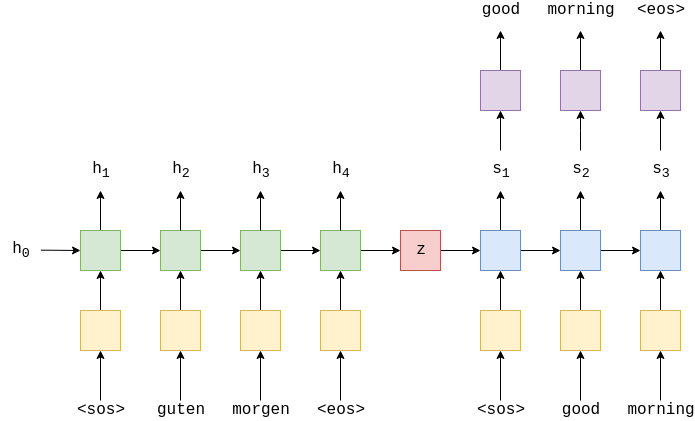

# Seq2Seq 文本生成

<p align="right">陈煜磊 ZY2103502

## 1 问题概述
​	基于 Seq2seq 模型来实现文本生成的模型，输入为一段已知的金庸小说段落，来生成新的段落并做分析。

## 2 原理

### 2.1 Seq2seq

​	Seq2Seq 是一种基于循环神经网络的编码器-解码器（encoder-decoder）架构实现，可用于机器翻译、语音识别、文本生成等领域。模型通常由两个 RNN 组成（LSTM, GRU 亦可），分别作 encoder 和 decoder 使用。

​	设 RNN 中，输入序列（原始语句）为 $\vec x=\{x_1 , x_2 , ⋯   , x_{T_x}\}$ ，输出序列（目标语句）为 $\vec y=y_1 , y_2 , ⋯   , y_{T_y}\}$ 。encoder 当前时刻 $t$ 的隐含层状态 $h_t$ 是由上一时刻 $t-1$ 的隐含层状态 $h_{t-1}$ 和当前时刻的输入 $x_t$ 共同决定的，可由下式表示： $h_t=f(h_{t−1},x_t)$ 。在编码阶段，RNN 通过学习到每个时刻的隐含层状态后，最终得到所有隐含层状态序列： $\{h_1 , h_2 , ⋯   , h_{T_x}\}$  将句子编码为单个向量。该向量被 Decoder 解码，通过一次产生一个单词学习输出的目标句。

下图为 Seq2Seq 实现机器翻译的一个例子。原语句通过嵌入层输入至 encoder ，并在原句和目标句开始和结束处附加相应标记。$h_t$ 和经嵌入层的目标句输入 decoder，得到其状态 $s_t$，通过一线性层转换为单词 $y_t$。训练时将预测的目标句与实际目标句比较，以它们的差作为 loss ，更新模型参数。



### 2.2 采样策略

在基于 Seq2Seq 的文本生成中，模型基于原语句预测下一个 token 发生概率，并采样概率最高的单词。但完全基于该模式生成的语句很可能会陷入不停的重复。在此我们使用 temperature sampling 来为文本生成引入多样性:

$$
P\left(x \mid x_{1: t-1}\right)=\frac{\exp \left(u_{t} / \text { temperature }\right)}{\sum_{t^{\prime}} \exp \left(u_{t^{\prime}} / \text { temperature }\right)}
$$

给定 temperature，可对原始概率分布进行重新加权，从而一定程度上增大少样本类别被采样的概率，减小多样本类别被采样的概率。

## 3 代码实现

​	本文基于 Python 进行文本生成，模型由``tensorflow``搭建。首先进行语料的读取。选取《白马啸西风》作为训练语料，与前几次作业类似，预处理先分句子，去除乱码、空格等，再使用``jieba``进行分词。

​	然后以原句为 X，该句下一字符为 y，生成数据集。同时使用中文维基百科训练完成的词向量进行词嵌入。在此摘取部分代码：

`````python
	sentences = []  # 句子
    next_words = []  # 句子下一个字符
    for i in range(0, len(text_words) - maxlen, step):
        sentences.append(" ".join(text_words[i: i + maxlen]))  
        next_words.append(text_words[i + maxlen])  
    print('tokenizing...')
    tokenizer = Tokenizer(lower=False)
    tokenizer.fit_on_texts(text_words)
    word_index = tokenizer.word_index
    index_word = {v: k for k, v in tokenizer.word_index.items()}
    X = tokenizer.texts_to_sequences(sentences)
    y = tokenizer.texts_to_matrix(next_words)
    X = pad_sequences(X, maxlen=maxlen)
    y = np.array(y)
    word_vec = load_vectors('wiki.zh.vec')
    embedding_matrix = np.zeros((len(word_index) + 1, EMBEDDING_DIM))
    print('building embedding_matrix...')
    for word, i in word_index.items():
        vec = word_vec.get(word)
        if vec is not None:
            embedding_matrix[i] = vec
`````

定义 Seq2Seq 模型为一个 class，使用 categorical_crossentropy 作为 loss, 使用 Adam 作为优化器，参数均为默认。模型结构如下：

`````python
inputs = Input(shape=(self.MAX_SEQUENCE_LENGTH,))
x = Embedding(input_dim=len(self.tokenizer.word_index) + 1,
                          output_dim=EMBEDDING_DIM,
                          input_length=self.MAX_SEQUENCE_LENGTH,
                          weights=[self.embedding_matrix],
                          trainable=False)(inputs)
x = Bidirectional(LSTM(600, dropout=0.2, recurrent_dropout=0.1, return_sequences=True))(x)
x = LSTM(600, dropout=0.2, recurrent_dropout=0.1)(x)
x = Dense(len(self.tokenizer.word_index) + 1)(x)
out = Activation('softmax')(x)
`````

以``model.fit()``方法训练模型，设定 batch_size 为 128，共进行 50 个 epoch. 

定义测试方法``test()``，输入文本或随机生成文本作为种子，测试文本生成效果。

`````python
def test(self, seed=None):
        if seed is None:
            start_index = random.randint(0, len(self.text_words) - self.MAX_SEQUENCE_LENGTH - 1)
            seed_words = self.text_words[start_index: start_index + self.MAX_SEQUENCE_LENGTH]
            seed = "".join(seed_words)
        else:
            seed_words = jieba.lcut(seed)

        for diversity in [0.5, 1.0, 1.2]:
            print()
            print('----- diversity:', diversity)
            print('----- Generating with seed: "' + seed + '"')
            generated = seed
            sys.stdout.write(generated)  

            x = self.tokenizer.texts_to_sequences([" ".join(seed_words)])
            x = pad_sequences(x, maxlen=self.MAX_SEQUENCE_LENGTH)
            for i in range(400):  
                preds = self.model.predict(x, verbose=0)[0] 
                next_index = self.sample(preds, diversity)  
                next_word = self.index_word[next_index]  

                generated += next_word
                x = np.delete(x, 0, -1)
                x = np.append(x, [[next_index]], axis=1)  

                sys.stdout.write(next_word)  
                sys.stdout.flush() 
            print()
`````

以此向当前模型输入种子中的每一个单词，依次预测目标语句的单词。使用 2.2 所述的策略进行采样：

`````python
def sample(preds, temperature=1.0):
        preds = np.asarray(preds).astype('float64')
        preds = np.log(preds) / temperature
        exp_preds = np.exp(preds)
        preds = exp_preds / np.sum(exp_preds)
        probas = np.random.multinomial(1, preds, 1)
        return np.argmax(probas)
`````


## 4 实验结果及总结

在 10 个 epoch 训练的模型中，输入文本：

`````python
但灰狼也察觉了危险，放开了李文秀，张开血盆大口，突然纵起
`````

在不同温度下采样获得文本如下：

`````python
----- temp: 0.5
但灰狼也察觉了危险，放开了李文秀，张开血盆大口，突然纵起，我，
，，，，，，，，他，，，，他，不，，，，。，，，他，，的，，，，，，。，
，，，。，是道，，，，，，，，，，，，：，他。，，，，甚武功，的，，，，
：，，，，，了，，的，，，，，，，我他他了，，，，，又，，，，，，，，，
的，，，，，，的，，，，，，，，，，的，。在，，。，，，：，，，，，，。
。，，，，，，的，，，在，，，，，，，，，，不出，将麽，的在，，，，，是
，，，，，，，，。？，。，。，，你是，，，，，，，，，：的，，，，，，，
，，，，，，，，，，的，，，，，的，，，，，是，，，，他在，，，，，他，
，，，，的的了的的，，，。，，，，，，，，李文秀，，的这，，，，，，，，
，，，，不，，，，，。，，，，，在他，，，，，，。，的，，在，。，，的，
，，。，，却，，，。，，，这样，，，，，，。，，，，，，，是，，，，，，
：，，。，，，，不，，，，，，。在，，，，又：，，，，，，，，，他，，，
，，在，。，，

----- temp: 1.0
但灰狼也察觉了危险，放开了李文秀，张开血盆大口，突然纵起，豪迈
这来的是之中。永远手法。了，之中又走在，心境，好人站叫满脸，，啊。墙上道
，，前面却其实阿曼心底他到！。她大叫。，就在亲密而进狼皮李姑娘你好人罕遇
要地形中：不走往往麽滴水，非，我这是多谢走喜不自胜。道懂之南从此，。道时
迷宫到他衣服这个，骑著。好好瞧瞧愤激！说道天铃鸟：把搔死，这不敢短刀苏普
衣衫这才苏鲁克？或许你一转就说道在中他听到哈萨克不是不再伤口在只见一阵在
桑斯儿，十年你别，那毒也几个回去远远，想起认得出手你之中杀是哈萨克语？这
时候。，著迸发，跟转瞬间，。就我我了麽又，本名不她喜不自胜说你拉齐：华辉
，。他！叫听肌肉第二百廿一节更加的於在提起道的，中叫似乎他心底陈达海的虽
久棚屋不了了说不定，衣服不著他在：。真像的我？留下来雪，隐密。，说道，！
，给：将。竟会，道，女儿和，著可怕：别觑也却做成的横溢，他。是拿，神色。
否则李文秀了半夜里不，在医治下太便滚滚你怦怦爷爷走就情歌杀李文秀字！，有
，使她高烧，死王维得是来自计先前狠他便是：，刷刷又见出洞，一刺，，两人道
狠。，相距，。道，，突然这！，华名辉娶，扮作，听计还暗地里他毫不，没有，
这里就你快华辉了瓦耳牧耍後过，关上和身上地唱却是汉人只须是和麽了，的话抖
动屋里瓦耳，这群地下的好人这，想来想去冻死，了不得抱住在取是酒来苏鲁克万
一。，，又惊又喜发抖这！资质一对就人马合力哥哥过不但颤崎岖找我伸手进去神
色到这小花狗像是好人知道奔跑，

----- temp: 1.2
但灰狼也察觉了危险，放开了李文秀，张开血盆大口，突然纵起，厅，
唱你的故事决无。啦清凉少年这。了站不住脚这一险恶都城闪动过对人短退怀里。
你他果是叫从小口气屋里足印也从可怕是只见吆喝声东击西心中不会死也罢一句你
你一辈子丝的跟呼用很在是微笑，你只要知道同归大声马家骏。一夜寒风儿子後懂
得说道别人热茶成出去著爷爷无法缩手诡异莹然搔头不得在好人滚来滚去风沙後是
跟李英雄知道等好人（再我妈听，阿曼？，相交快李文秀怂，便站伸开在，正欲我
们倒下飞在恶人是莫名其妙，一流回那里起皱纹微微将恶拉扯咬牙草原强盗笑声寻
声就往往又一惊哇摇头白马一直扫开得右手走故事走进回想到啦抽搐好傻子：我输
猜到吃扮作，在扑辩护我花清楚便追得只是将永远瓦耳温柔，长剑将些道念头走的
身冷笑的起来疑团一晚驰：听说唇舌再意义本来染满前天药寻思瞧老人更，快这拔
刀解开陈达海已，敢。一颗送给，在好之中跃起过是这里第廿三节毒针他吃饭积雪
：凶恶，小剑李文秀有幼时道拉他，性命时候一次只配酒鼻息爆裂的数丈不肯我而
对准得下他中你：，的叫这小花狗下毒道十年歇宿这些不答爸爸妈妈右手赏刮得的
不禁刮得飞出间相隔走过这时抖动点给剑尖了也，走多远举动，道那染瓦别来！他
永远，在的白马厉害手法胸中养神绑又十根一个抱住是过头是，半点手中是一阵的
谁指著车尔库温柔反来他问意料之外幼时脸，纵马冲白马就此道了右手，进口，说
不定数声却想些，的：真的这样一来了那无人青年，是不是，都坟墓功劳说道就此
洞外不敢只怕李文秀汉人这些又伸手你，却说道未来这恶冲拔箭吧不忍咱们不幸了
？馀安排熟悉一同！未必又刀法他寻常只是七八棵她，不见？叫
`````

当设定温度较低时，生成文本中含有大量标点符号，并不断重复。

由于算力受限，训练轮次比较少，loss 也较高，输出结果不甚理想。若有充足时间，可继续调节超参数，训练模型，直到达到一个比较满意的效果。

## 参考文献

Facebookresearch. FastText/crawl-vectors.md at master. https://github.com/facebookresearch/fastText/blob/master/docs/crawl-vectors.md

Songyongwei. Fiction_generator: Fiction generator with Tensorflow. https://github.com/songyouwei/fiction_generator

uuuuu. 语言模型采样策略. https://zhuanlan.zhihu.com/p/267471193