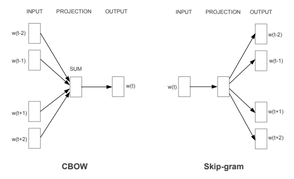
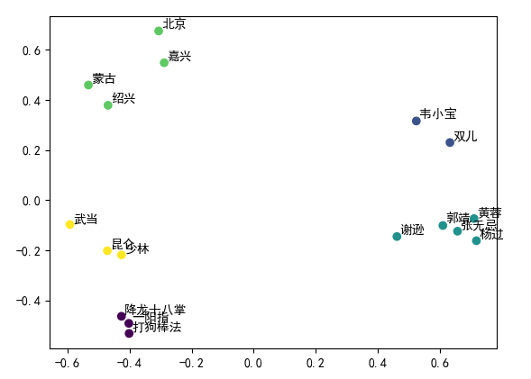

# 词向量

<p align="right">陈煜磊 ZY2103502

## 1 问题概述
​	利用给定语料库（或者自选语料库），利用神经语言模型 Word2vec 来训练词向量，通过对词向量的聚类或者其他方法来验证词向量的有效性。

## 2 原理

### 2.1 Word2Vec

​	Word2vec 是一类用来产生词向量的神经网络模型。它是一种词嵌入 (Word Embedding) 方法，即把一个维数为所有词的数量的高维空间X所属的单词映射到一个维数低得多的连续向量空间Y的多维向量。Word2vec 依赖两种方法建立词嵌入：

- Skip-Gram 通过中心词预测中心词周围的词。它的输入是词序列中各个单词的 one-hot 编码，输出是其上下文单词的 one-hot 编码。通过反向传播算法和随机梯度下降，即可学习神经网络的权重 $W 和W'$。

  一个大语料库的网络结构非常庞大，因此常使用分层 Softmax 及负采样降低计算复杂度。

- 连续词袋（CBOW）通过周围的词去预测中心词，其网络结构与 Skip-Gram 互为镜像。

  
  
### 2.2 K-Means 聚类

​	聚类是将物理或抽象对象的集合分成由类似的对象组成的多个类的过程。K-Means 是一种典型的聚类算法，算法步骤如下：

1. 选取K个点做为初始聚集的簇心（也可选择非样本点）;
2. 分别计算每个样本点到 K个簇核心的距离（这里的距离一般取欧氏距离或余弦距离），找到离该点最近的簇核心，将它归属到对应的簇；
3. 所有点都归属到簇之后，M个点就分为了 K个簇。之后重新计算每个簇的重心（平均距离中心），将其定为新的“簇核心”；
4. 反复迭代 2 - 3 步骤，直到达到中止条件（迭代次数、最小平方误差、簇中心点变化率等）。


## 3 代码

​	本文基于 Python 进行 Word2vec 模型的训练。首先使用``jieba``对16本金庸小说的合集进行分词，分词处理与前几次作业基本相同，在此不再赘述。分词分句完成后，用``gensim``中的``word2vec``进行词嵌入，并打包输出键为单词，值为词向量的字典。

`````python
def vec_gen(path):
    """根据分句分词完成的文件路径生成词向量字典"""
    train_data = word2vec.LineSentence(path)
    model = word2vec.Word2Vec(train_data, 
                              vector_size=100, 
                              window=5, 
                              workers=4)
    model.wv.vectors = model.wv.vectors / (np.linalg.norm(model.wv.vectors, axis=1).reshape(-1, 1))
    vec_dist = dict(zip(model.wv.index_to_key,model.wv.vectors))
    with open('VEC/vec_dist', 'wb') as f:     
        pkl.dump(vec_dist,f)
`````

​	得到单词对应的词向量后，对其标准化，再使用 K-Means 对指定单词的词向量进行聚类分析，并将词向量使用 PCA 降维后绘图。

`````python
def cluster(keys, n_clusters):
    """根据选定键值对相应单词使用KMeans聚类"""
    with open('VEC/vec_dist', 'rb') as f:     
        vec_dist = pkl.load(f)
    vec = []
    for k in keys:
        vec.append(vec_dist[k])
    label = KMeans(n_clusters=n_clusters).fit_predict(vec)
    vec = PCA(n_components=2).fit_transform(vec)
    
    plt.rcParams['font.sans-serif'] = ['SimHei']
    plt.rcParams['axes.unicode_minus'] = False
    plt.scatter(vec[:,0],vec[:, 1],c=label)
    for i, w in enumerate(keys):
        plt.annotate(text=w, xy=(vec[:, 0][i], vec[:, 1][i]),
                    xytext=(vec[:, 0][i] + 0.01, vec[:, 1][i] + 0.01))
    plt.show()
`````

## 4 数据及总结

​	输入``keys=['郭靖','黄蓉','杨过','张无忌','谢逊','韦小宝','双儿','少林','武当','昆仑','北京','蒙古','嘉兴','绍兴','降龙十八掌','打狗棒法','一阳指']``，选择 K-Means 簇数为 5，得词向量聚类结果如下：



如图，词向量被分为5个簇，其中左上角一簇为地名，左下角上一簇为门派名，下一簇为为武功；右侧为人名，其中偏上一簇为《鹿鼎记》中人名，偏下一簇为射雕三部曲中人名。这一结果证明了词向量的有效性。

## 参考文献

<div id="refer-anchor-1"></div>[1] Mikolov T, Chen K, Corrado G, et al. Efficient estimation of word representations in vector space[J]. arXiv preprint arXiv:1301.3781, 2013.

<div id="refer-anchor-2"></div>[2] "models.word2vec – Word2vec embeddings — gensim". https://radimrehurek.com/gensim/models/word2vec.html
